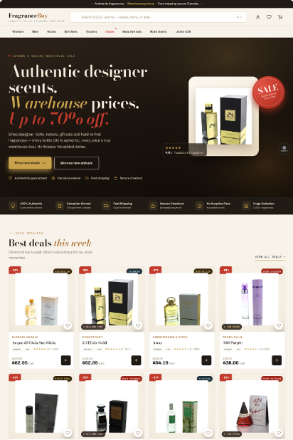

# FragranceBuy: Deals vs. Discovery · Direction A (Deal-led)

**A conversion-focused homepage concept for FragranceBuy.ca that turns the deal all the way up.**

[**Live prototype**](https://fragrancebuy-redesign.vercel.app/) · [**Case study**](https://www.szn4.design/fragrancebuy-deals-vs-discovery/) · [Direction B (Trust + Discovery)](https://github.com/SZN4Design/Fragrancebuy-redesign-ProtoypeB)



## The idea

FragranceBuy already has a strong reason to shop there: authentic fragrances at warehouse prices. This direction tests a simple hypothesis: **if savings, urgency and product access are front and centre, shoppers who already know what they want will reach products and the cart faster.**

It's one half of a two-direction CRO study. [Direction B](https://github.com/SZN4Design/Fragrancebuy-redesign-ProtoypeB) tests the opposite idea: guidance and reassurance for shoppers who don't know what they want yet.

## What's in the page

- Deal-led hero with warehouse pricing and the discount visible before the first scroll
- "Best Deals This Week" grid with sale badges, savings and quick-add
- Trending, Shop by Brand and Shop by Format shortcuts (boxed bottles, testers, gift sets, decants)
- A free-shipping progress bar that makes the threshold tangible
- Trust bar and authenticity section

### Built-in review tools

A floating **PROTO** button (bottom-right) opens:

- **Desktop / Mobile preview:** frames the page in a phone
- **A/B annotations:** numbered callouts explaining the CRO reasoning behind each section
- **Metrics panel:** the KPIs this layout is designed to move

## Measurement plan

| | |
|---|---|
| **Primary metric** | Revenue per visitor |
| **Supporting signals** | Hero CTA click-through, quick-add and add-to-cart rate, products viewed per session |
| **Guardrail** | Cart abandonment |

This is a proposed plan. No live A/B test was run.

## Built with

Vanilla HTML, CSS and JavaScript in a single `index.html`, with no framework and no build step. Deployed on Vercel.

## Run it locally

Open `index.html` in a browser, or:

```bash
python3 -m http.server 8000
# then visit http://localhost:8000
```

## Notes

- Independent concept and portfolio piece. **Not affiliated with or endorsed by FragranceBuy.ca.**
- Prices, ratings and metrics are illustrative. Product photos are referenced from FragranceBuy's public CDN for demonstration only.

---

Designed and built by **Sabrina Mohammed** · [szn4.design](https://www.szn4.design/) · [LinkedIn](https://www.linkedin.com/in/sabrina-mohammed-31694483/)
